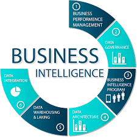

# Inteligencia de negocios

Este repositorio contiene informacion relacionada con inteligencia de negocios:

1. Concepto basicos de inteligencia de negocios
1. Modelo dimensional (Modelo estrella y copo de nieve)
1. Proceso de creación de ETL en SQL Integration Services
1. Automatización de los procesos ETL
1. Visualización en Dashboard con Power BI